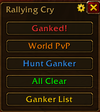
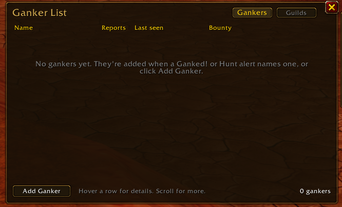
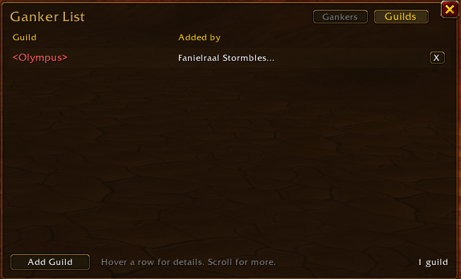
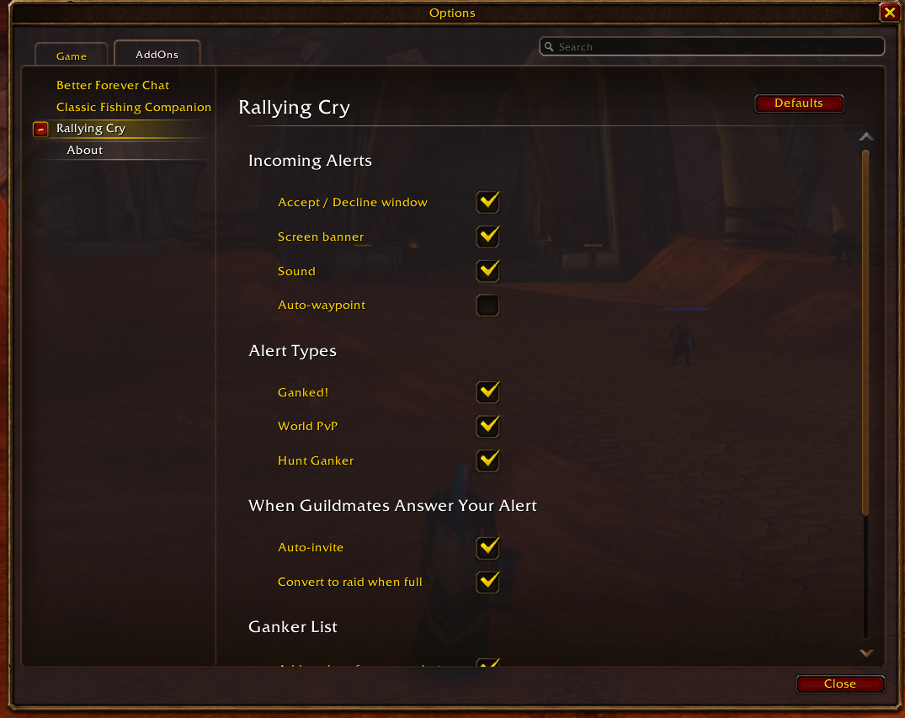

# Rallying Cry

Call your guild for backup in **WoW: Forever**. One button tells every guildmate running Rallying Cry where you are and what's going on: you're being ganked, there's a world PvP fight worth joining, or you're putting together a party to hunt a ganker down.

Alerts go over the hidden guild addon channel. Nobody outside your guild sees them, and you have to be in a guild to send or receive.

<p align="center"></p>

> **WoW: Forever only.** Built for the Forever client (interface 16001). It won't load on Classic Era, and isn't supported on Retail.

> **Early version.** Rallying Cry is being built and tested on the Forever beta. Expect rough edges, and please [report anything odd](https://github.com/DigitalPenguin1/RallyingCry/issues).

## Quick Start

1. Install the addon and join a guild. Your guildmates need Rallying Cry too
2. Click the **Rallying Cry minimap button** to open the alert panel, and press **Ganked!** when you're in trouble
3. When a guildmate calls for help, click **Accept** to join their group and get a waypoint to them

You never have to type a command. The minimap button does it all:

| Minimap button | What it does |
|---|---|
| **Left-click** | Show or hide the alert panel |
| **Shift-click** | Open the ganker list |
| **Right-click** | Open settings |
| **Hover** | See the last alert |
| **Drag** | Move it around the minimap |

Slash commands are there too, if you prefer typing or want to put alerts in a macro.

## Alerts

Click a button on the panel to send an alert, or bind it to a key. The command column is optional.

| Alert | Or type | What guildmates see |
|---|---|---|
| **Ganked!** | `/rc gank [note]` | You're being ganked, plus your zone, subzone, and coordinates |
| **World PvP** | `/rc wpvp [note]` | There's a fight at your location |
| **Hunt Ganker** | `/rc hunt [name] [note]` | You're hunting a ganker. Uses your target if it's an enemy player, otherwise the name you type (first name and surname) |
| **All Clear** | `/rc clear` | You're safe, call it off. Closes their Accept/Decline window and removes the waypoint to you. Only works while you have an alert out (10 minutes) |

Each incoming alert shows up in chat and as a banner across the middle of your screen, with a sound. If your target is an enemy player when you send, their name and guild ride along, and guildmates see **(KOS guild)** if that guild is on your KOS list.

## Accept or Decline

Ganked!, World PvP, and Hunt Ganker alerts pop up a window for guildmates with **Accept** and **Decline**.

- **Accept** puts a waypoint on the alert and tells the person who sent it. Their client invites you automatically, so they don't have to stop fighting to do it. If their party is full and they lead it, it turns into a raid first.
- **Decline** closes the window. Nothing gets sent.

The window closes on its own after 60 seconds, or when the sender calls All Clear. If you're already in a group you can't be invited, but the sender still hears you're on the way. If they can't invite you (they aren't group leader, or the raid is full), you get told why and can follow the waypoint.

## Ganker List and Bounties

The guild keeps one shared list of gankers. Anyone running Rallying Cry sees the same list, and it catches you up on anything you missed when you log in.

<p align="center"></p>

- **Adding**: anyone named in your Ganked! or Hunt alert goes on the list automatically, and repeat reports bump their count and last-seen zone. You can also click **Add Ganker**, which opens a form for the name (or Use Target), an optional reason, and an optional bounty, or type `/rc kos add First Surname reason`
- **Removing**: only the person who added them, or an officer, can take someone off. Officers are any rank with the guild's **Remove Member** permission
- **Bounties**: click **Bounty** on a row, or `/rc bounty First Surname 50`, to pledge 50 gold. Several guildmates can stack bounties on the same ganker. `/rc bounty First Surname 0` withdraws yours
- **Claiming**: kill a ganker with a bounty, then click **Claim** or type `/rc claim First Surname`. Each poster gets a Confirm/Deny window (even if they were offline when you claimed). Confirm reminds them to mail you the gold
- **Warnings**: target or mouse over a listed ganker, or a member of a KOS guild (including its numbered guilds), and you get a chat warning and a sound, with their bounty. Each player warns at most once a minute
- **KOS guilds**: officers can put a whole guild on KOS. Every member then counts as a ganker without being added one by one. Switch the list window to **Guilds**, click **Add Guild** (it fills in your target's guild), or type `/rc kos guild add Guild Name - reason`. Alerts show the ganker's guild and flag KOS guilds
- **Guild families**: adding **Olympus** also covers numbered guilds like Olympus 2, Olympus II, and Olympus #3 (untick the box in the form for an exact match only). End a name with `*`, like **Olympus\***, to cover every guild that starts with it. Targeting a member of Olympus 2 and clicking Add Guild fills in Olympus. Entries that would cover your own guild are refused

<p align="center"></p>

The addon can't hold or move gold. A bounty is a pledge, and the poster pays it by mail.

Open the list from the **Ganker List** button on the panel, Shift-click the minimap button, a keybinding, or `/rc kos`. Gankers with the biggest bounty are listed first, and KOS guilds are listed A to Z. Hover a row for the reason, who added them, their guild, where they were last seen, and each bounty. Auto-adding and warnings can each be turned off in settings.

## Features

<p align="center"></p>

- **Settings page**: ESC > Options > AddOns > Rallying Cry, the gear on the panel, `/rc settings`, or right-click Rallying Cry in the addon compartment. Every option below is there as a checkbox, plus an **About** page
- **Minimap button**: left-click toggles the panel, Shift-click opens the ganker list, right-click opens settings, drag to move. Hover to see the last alert. On by default, turn it off in settings or with `/rc minimap`
- **Button panel**: draggable, one click per alert plus a Ganker List button and a settings gear. Works in combat. `/rc panel` to show or hide
- **Keybindings**: ESC > Options > Keybindings > AddOns > Rallying Cry. Bind any of the four alerts, waypoint to last alert, the panel, or the ganker list
- **Waypoints**: `/rc go` pins the last alert on your map and tracks it. `/rc waypoint` does it automatically for every alert
- **Alert log**: `/rc log` shows the last 10 alerts, saved across sessions
- **Mute by type**: `/rc mute wpvp` keeps an alert type in chat but drops the window, banner, and sound
- **Spam guard**: 10 second cooldown between your alerts, and repeat alerts from the same person get dropped. All Clear skips the cooldown but only works while you have an alert out

## Slash Commands (optional)

Everything below is also on the minimap button, the panel, or the settings page. Commands are handy for macros and keybind addons.

Forever characters have a first name and a surname. Where a command takes a name, type both, like `/rc hunt Gankzor Blackhand camping the docks`.

```
/rc gank [note]         you're being ganked
/rc wpvp [note]         world PvP here
/rc hunt [name] [note]  hunting a ganker
/rc clear               call off your alert
/rc go                  waypoint to the last alert
/rc log                 recent alerts
/rc kos                 open the ganker list
/rc kos add <name> [reason]
/rc kos remove <name>
/rc kos guild add <guild> [- reason]   officers only
/rc kos guild remove <guild>           officers only
/rc bounty <name> <gold> pledge gold on a ganker (0 withdraws)
/rc claim <name>        claim the bounties on a ganker you killed
/rc settings            open the settings page
/rc panel               show/hide the button panel
/rc minimap             show/hide the minimap button
/rc sound               toggle alert sound
/rc banner              toggle the screen banner
/rc waypoint            toggle auto-waypoint
/rc popup               toggle the Accept/Decline window
/rc invite              toggle auto-inviting guildmates who accept
/rc raid                toggle turning a full party into a raid
/rc mute <type>         silence gank, wpvp, or hunt
/rc version             addon and protocol version
/rc debug               debug output
```

## Limits

Forever runs the modern addon API with Midnight's restrictions, which shapes what Rallying Cry can do:

- **No automatic gank detection.** The combat log is blocked for addons, so you press the button yourself.
- **Target names can be hidden in combat.** If the game hides your target's name or guild, the alert goes out without it. Use `/rc hunt First Surname` to name the ganker by hand.
- **No coordinates inside instances.** The game hides your position there. The alert still sends the zone name.
- **Ganker warnings may not fire in combat**, for the same reason.
- Guildmates only see alerts if they have Rallying Cry installed.

## What Gets Shared

Everything goes over the hidden guild addon channel, so only guildmates running Rallying Cry see it.

- **Alerts** send your character name, zone, subzone, map coordinates, your enemy target's name and guild (if any), and your note
- **Accepting an alert** tells the sender you're coming
- **The ganker list, KOS guilds, and bounties** are copied to every guildmate's computer, so they survive as long as anyone in the guild has them

Nothing leaves the game. Rallying Cry has no website, account, or tracking.

## Install

Unzip into `World of Warcraft/_classic_beta_/Interface/AddOns/` so you get `AddOns/RallyingCry/RallyingCry.toc`, then restart the game. `_classic_beta_` is the beta folder; after launch, use the AddOns folder inside your Forever install.

## Troubleshooting & Support

| Issue | Solution |
|-------|----------|
| "You need to be in a guild" | Rallying Cry only works inside a guild. Join one, then `/reload` |
| Guildmates don't see my alerts | They need Rallying Cry installed and enabled. Alerts also can't send during a dungeon boss fight or a PvP match |
| No invite after clicking Accept | The sender has to lead their group (or not be in one), and you can't already be in a group. You'll get a message saying which |
| Alert has no coordinates | The sender was in an instance, where the game hides positions |
| Ganker list is empty on a new character | It fills in from guildmates (gankers, KOS guilds, and bounties) within about 20 seconds of logging in. Someone with the list has to be online |
| Can't add a KOS guild | Only officers (ranks with the Remove Member permission) can add or remove KOS guilds |
| A numbered guild isn't flagged | KOS guilds added before the numbered option only match exactly. Add the guild again with the box ticked |
| Panel or minimap button missing | `/rc panel` or `/rc minimap`, or check the settings page |
| New version didn't load | Fully restart the game after updating, not just `/reload` |

**Debug tip**: `/rc debug` logs every message Rallying Cry sends and receives. To copy chat output, install [Chat Copy Paste](https://www.curseforge.com/wow/addons/chat-copy-paste).

**Bugs and ideas**: https://github.com/DigitalPenguin1/RallyingCry/issues

**Support development**: if you enjoy Rallying Cry, you can [buy me a coffee](https://buymeacoffee.com/relyk22).

## Version History

See [CHANGELOG.md](CHANGELOG.md).

## License

All rights reserved. You're welcome to use Rallying Cry and report bugs or ideas, but please don't copy, modify, or republish it. See [LICENSE](LICENSE).
